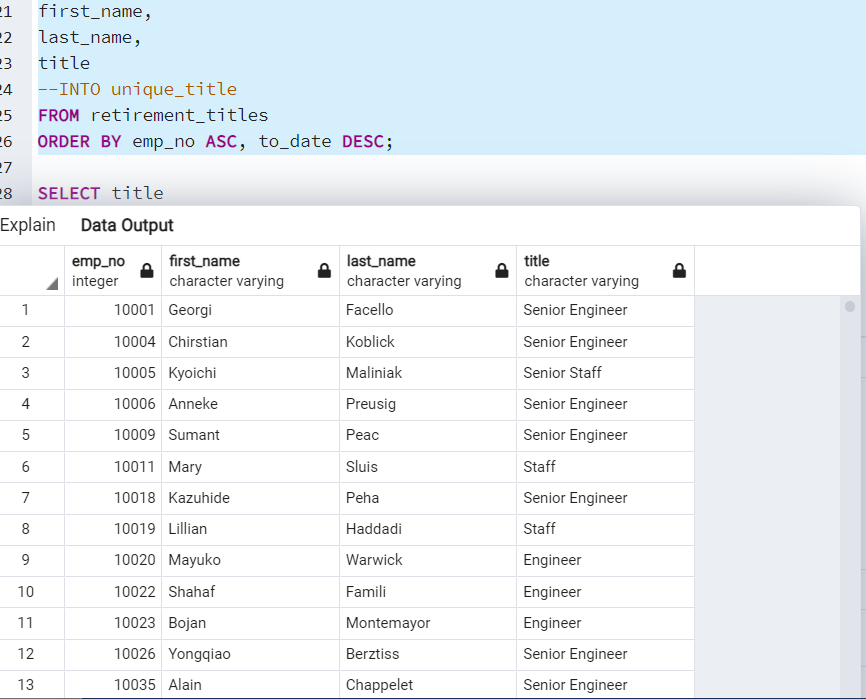
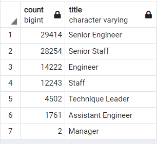
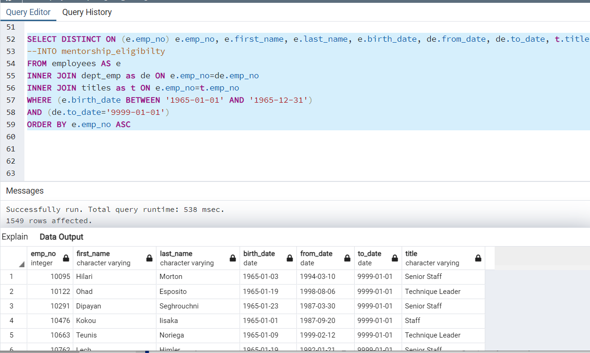

## All the analysis for this project is found in the ../Analysis Projects Folder/Pewlett-Hackard-Analysis Folder/

# Pewlett-Hackard-Analysis

#Purpose:
The purpose of this analysis is to discover how many employees will be retiring.  And the second part is to find out which employees are eligible to participate in a mentorship program.

Analysis:
In this analysis the emp_no, first_name, and last_name columns were retieved from the Employees table.
The title, from_date, and to_date columns were retrieved from the Titles table.
The two tables were inner joined on their primary key.
Then data was filtered on the birth_date column to retrieve the employees who were born between 1952 and 1955 and ordered by the employee number, then it was saved into the retirement_titles.csv.
The starter code was used on the DISTINCT ON statement to retrieve the fist occurrence of the employee number for each set of rows.

The next analysis was to find out the number of retiring employees with their recent job title . To find this out, the number of titles from the unique_titles was retrieved and then grouped by title , and the count column was sorted in descending order.

In Deliverable 2, the analysis was to find out which employees are qualified for the mentorship program .
To perform this query, the emp_no, first_name, last_name and birth_date was retrieved from the Employees table and from_date and to_date was retervied from the Department Employees table.  The title column was  retrieved  from the Titles table.  The DISTINCT ON statement to retrieve the fist occurrence of the employee number for each set of rows.
The Employees and Department Employee tables were inner joined on the primary key.  The Titles and Employees tables were inner joined on the primary key as well.
The information then was filtered on the to_date to find employees whose birthday is between January 1, 1965 and December 31, 1965.  The new table created is called mentorship eligibility which was ordered by employee number.  

# Summary:
From the analysis the conclusion is that there is over 90,000 employees retiring in the next short while.  We can also see that there are only 1549 people eligible for mentorship  program.  Pewlett_Hackard now knows that the "silver tsunami" is coming. 
